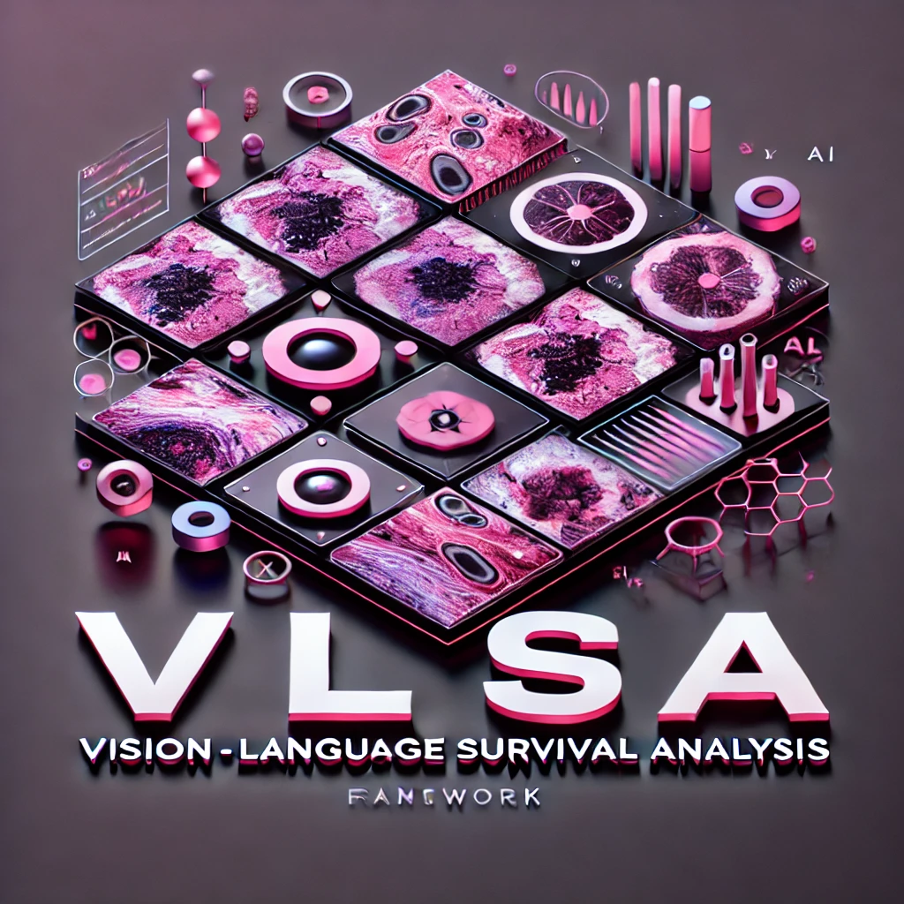

# VLSA: Interpretable Vision-Language Survival Analysis with Ordinal Inductive Bias for Computational Pathology

[[Paper]](https://openreview.net/pdf?id=trj2Jq8riA) | [[VLSA Walkthrough]](https://github.com/liupei101/VLSA?tab=readme-ov-file#vlsa-walkthrough) | [[Awesome Papers of Pathology VLMs]](https://github.com/liupei101/VLSA?tab=readme-ov-file#-awesome-papers-of-pathology-vlms) | [[Zhihu (中文)]](https://zhuanlan.zhihu.com/p/721597334) | [[WSI Preprocessing]](https://github.com/liupei101/VLSA?tab=readme-ov-file#wsi-preprocessing) | [[Acknowledgements]](https://github.com/liupei101/VLSA?tab=readme-ov-file#acknowledgements) | [[Citation]](https://github.com/liupei101/VLSA?tab=readme-ov-file#-citation)



**Abstract**: Histopathology Whole-Slide Images (WSIs) provide an important tool to assess cancer prognosis in computational pathology (CPATH). While existing survival analysis (SA) approaches have made exciting progress, they are generally limited to adopting highly-expressive architectures and only coarse-grained patient-level labels to learn prognostic visual representations from gigapixel WSIs. Such learning paradigm suffers from important performance bottlenecks, when facing present scarce training data and standard multi-instance learning (MIL) framework in CPATH. To overcome it, this paper, for the first time, proposes a new Vision-Language-based SA (**VLSA**) paradigm. Concretely, (1) VLSA is driven by pathology VL foundation models. It no longer relies on high-capability networks and shows the advantage of *data efficiency*. (2) In vision-end, VLSA encodes prognostic language prior and then employs it as *auxiliary signals* to guide the aggregating of prognostic visual features at instance level, thereby compensating for the weak supervision in MIL. Moreover, given the characteristics of SA, we propose i) *ordinal survival prompt learning* to transform continuous survival labels into textual prompts; and ii) *ordinal incidence function* as prediction target to make SA compatible with VL-based prediction. Notably, VLSA's predictions can be interpreted intuitively by our Shapley values-based method. The extensive experiments on five datasets confirm the effectiveness of our scheme. Our VLSA could pave a new way for SA in CPATH by offering weakly-supervised MIL an effective means to learn valuable prognostic clues from gigapixel WSIs.

<!-- Insert a pipeline of your algorithm here if got one -->
<div align="center">
    <a href="https://"></a>
</div>

---

*On updating. Stay tuned.*

📚 Recent updates:
- 25/02/08: upload the patch features (31.86G in files) used in VLSA; you can download them from [here](https://pan.baidu.com/s/1a8ZYQJAYfl2zw7HcuaI4ig?pwd=6f4s).
- 25/01/23: VLSA is accepted to ICLR 2025
- 24/10/07: add the [Notebook - VLSA Walkthrough](https://github.com/liupei101/VLSA/blob/main/notebook/VLSA-Walkthrough.ipynb)
- 24/09/24: codes & papers are live
- 24/09/10: release VLSA

## VLSA Walkthrough

Please refer to our [Notebook - VLSA Walkthrough](https://github.com/liupei101/VLSA/blob/main/notebook/VLSA-Walkthrough.ipynb). It provides the detail of
- individual incidence function prediction in VLSA models;
- and prediction interpretation using our Shapley values-based method.

## 👩‍💻 Running the Code

### Pre-requisites

All experiments are run on a machine with
- two NVIDIA GeForce RTX 3090 GPUs
- python 3.8 and pytorch==1.11.0+cu113

Detailed package requirements:
- for `pip` or `conda` users, full requirements are provided in [requirements.txt](https://github.com/liupei101/VLSA/blob/main/requirements.txt).
- for `Docker` users, you could use our base Docker image via `docker pull yuukilp/deepath:py38-torch1.11.0-cuda11.3-cudnn8-devel` and then install additional essential python packages (see [requirements.txt](https://github.com/liupei101/VLSA/blob/main/requirements.txt)) in the container.

### Training models 

Use the following command to load an experiment configuration and train the VLSA model (5-fold cross-validation):
```bash
python3 main.py --config config/IFMLE/tcga_blca/cfg_vlsa_conch.yaml --handler VLSA --multi_run
```

All important arguments are explained in `config/IFMLE/tcga_blca/cfg_vlsa_conch.yaml`. 

For the traditional SA models only using visual features, use this one:
```bash
python3 main.py --config config/IFMLE/tcga_blca/cfg_sa_base_conch.yaml --handler SA --multi_run
```

## Training Logs

We advocate open-source research. Our full training logs for `VLSA` models can be accessed at [Google Drive](https://drive.google.com/drive/folders/18_N2_fNduFcXnxQOtbfP07zNJ91PU1hJ?usp=drive_link). 

## 🔥 Awesome Papers of Pathology VLMs

**Foundational VLMs for computational pathology**:

| Model          | Architecture | Paper             | Code            | Data   |
| :------------- | :---------------- | :---------------- | :-------------- | :----- |
| PLIP (NatMed'23) | [CLIP](https://github.com/openai/CLIP) | [A visual language foundation model for pathology image analysis using medical twitter](https://www.nature.com/articles/s41591-023-02504-3) | [Github](https://github.com/PathologyFoundation/plip) | 208,414 pathology images paired with natural language descriptions from twitter |
| Quilt-Net (NeurIPS'23) | [CLIP](https://github.com/openai/CLIP) | [Quilt-1M: One million image-text pairs for histopathology](https://papers.neurips.cc/paper_files/paper/2023/hash/775ec578876fa6812c062644964b9870-Abstract-Datasets_and_Benchmarks.html) | [Github](https://github.com/wisdomikezogwo/quilt1m)            | 802,148 image and text pairs from YouTube  |
| CONCH (NatMed'24) | [CoCa](https://arxiv.org/pdf/2205.01917) | [A Vision-Language Foundation Model for Computational Pathology](https://www.nature.com/articles/s41591-024-02856-4) | [Github](https://github.com/mahmoodlab/CONCH) | over 1.17 million image-caption pairs  |
| CPLIP (CVPR'24)     | [CLIP](https://github.com/openai/CLIP) | [CPLIP: Zero-Shot Learning for Histopathology with Comprehensive Vision-Language Alignment](https://openaccess.thecvf.com/content/CVPR2024/papers/Javed_CPLIP_Zero-Shot_Learning_for_Histopathology_with_Comprehensive_Vision-Language_Alignment_CVPR_2024_paper.pdf) | [Github](https://github.com/iyyakuttiiyappan/CPLIP)            | Many-to-many VL alignment on ARCH dataset |
| PathAlign (arXiv'24) | [BLIP-2](https://arxiv.org/abs/2301.12597) | [PathAlign: A vision-language model for whole slide images in histopathology](https://arxiv.org/abs/2406.19578) | -  |  over 350,000 WSIs and diagnostic text pairs |
| TITAN (arXiv'24) | [CoCa](https://arxiv.org/pdf/2205.01917) | [Multimodal Whole Slide Foundation Model for Pathology](https://arxiv.org/abs/2411.19666) | [Github](https://github.com/mahmoodlab/TITAN)  |  Slide-level vision-language alignment |

**VLM-driven computational pathology tasks**:

| Model          | Subfield    | Paper             | Code            | Base   |
| :------------- | :---------- | :---------------- | :-------------- | :----- |
| TOP (NeurIPS'23)      | WSI Classification    | [The rise of ai language pathologists: Exploring two-level prompt learning for few-shot weakly-supervised whole slide image classification](https://papers.nips.cc/paper_files/paper/2023/hash/d599b81036fd1a3b3949b7d444f31082-Abstract-Conference.html) | [Github](https://github.com/miccaiif/TOP)            | Few-shot WSI classification   |
| FiVE (CVPR'24)     | WSI Classification    | [Generalizable whole slide image classification with fine-grained visual-semantic interaction](https://openaccess.thecvf.com/content/CVPR2024/papers/Li_Generalizable_Whole_Slide_Image_Classification_with_Fine-Grained_Visual-Semantic_Interaction_CVPR_2024_paper.pdf) | [Github](https://github.com/ls1rius/WSI_FiVE)            | VLM pretraining for WSI classification  |
| ViLa-MIL (CVPR'24)         | WSI Classification   | [Vila-mil: Dual-scale vision language multiple instance learning for whole slide image classification](https://openaccess.thecvf.com/content/CVPR2024/papers/Shi_ViLa-MIL_Dual-scale_Vision-Language_Multiple_Instance_Learning_for_Whole_Slide_Image_CVPR_2024_paper.pdf) | [Github](https://github.com/Jiangbo-Shi/ViLa-MIL)                 | Dual-scale features for WSI classification |
| CoD-MIL (TMI'24)         | WSI Classification   | [CoD-MIL: Chain-of-Diagnosis Prompting Multiple Instance Learning for Whole Slide Image Classiffcation](https://ieeexplore.ieee.org/document/10731873) | Github | An improved version of ViLa-MIL |
| VLSA (ICLR'25)         | WSI Survival Analysis | [Interpretable Vision-Language Survival Analysis with Ordinal Inductive Bias for Computational Pathology](https://openreview.net/pdf?id=trj2Jq8riA) | [Github](https://github.com/liupei101/VLSA)  | VLM-driven vision-language survival analysis |
| QPMIL-VL (AAAI'25)         | WSI Classification | [Queryable Prototype Multiple Instance Learning with Vision-Language Models for Incremental Whole Slide Image Classification](https://arxiv.org/abs/2410.10573) | [Github](https://github.com/can-can-ya/QPMIL-VL)  | VLM-driven Incremental Learning for WSIs |

**NOTE**: please open *a new PR* if you want to add your work into this table.

## WSI Preprocessing

Following [CONCH](https://github.com/mahmoodlab/CONCH), we first divide each WSI into patches of 448 * 448 pixels at 20x magnification. Then we adopt the image encoder of CONCH to extract patch features.

Our complete procedure in WSI preprocessing follows [Pipeline-Processing-TCGA-Slides-for-MIL](https://github.com/liupei101/Pipeline-Processing-TCGA-Slides-for-MIL). You could 
- download the patch features used in the experiment from [here](https://pan.baidu.com/s/1a8ZYQJAYfl2zw7HcuaI4ig?pwd=6f4s),
- or move to it for a detailed tutorial and try it on your own dataset.

## Acknowledgements

Some parts of codes in this repo are adapted from the following amazing works. We thank the authors and developers for their selfless contributions. 

- [CONCH](https://github.com/mahmoodlab/CONCH): our VLSA is driven by this great pathology VLM.
- [OrdinalCLIP](https://github.com/xk-huang/OrdinalCLIP): adapted for survival prompt learning.
- [SurvivalEVAL](https://github.com/shi-ang/SurvivalEVAL): used for performance evaluation (D-cal and MAE computation).
- [Patch-GCN](https://github.com/mahmoodlab/Patch-GCN): we follow its all data splits in 5-fold cross-validation.

## License and Terms of Use

ⓒ UESTC. The models and associated code are released under the CC-BY-NC-ND 4.0 license and may **only be used for non-commercial, academic research purposes with proper attribution**. Any commercial use, sale, or other monetization of the VLSA model and its derivatives is prohibited and requires prior approval. If you are a commercial entity, please contact the corresponding author.

## 📝 Citation

If you find this work helps your research, please consider citing our paper:
```txt
@inproceedings{liu2025vlsa,
  title={Interpretable Vision-Language Survival Analysis with Ordinal Inductive Bias for Computational Pathology},
  author={Pei Liu and Luping Ji and Jiaxiang Gou and Bo Fu and Mao Ye},
  booktitle={The Thirteenth International Conference on Learning Representations},
  year={2025},
  url={https://openreview.net/forum?id=trj2Jq8riA},
}
```