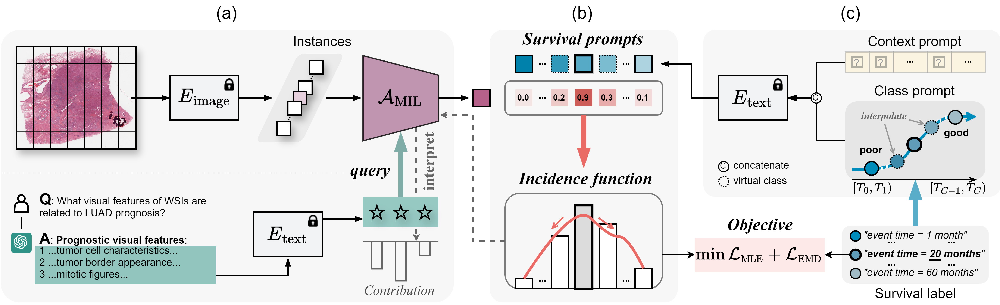

# VLSA

**Interpretable Vision-Language Survival Analysis with Ordinal Inductive Bias for Computational Pathology**

*On updating. Paper and code will release soon. Stay tuned.*

**Abstract**: Histopathology Whole-Slide Image (WSI) is a kind of important tool to assess cancer patients' prognosis in computational pathology (CPATH). However, it remains challenging for existing methods to model gigapixel WSIs for survival analysis (SA) due to the inherent limitations of current practices: i) most deep SA networks rely on sufficient training data while WSI data is often scarce in CPATH; ii) they are usually required to learn strong prognostic features from numerous instances under weak supervision. To address these limitations, this paper presents a new Vision-Language-based SA paradigm for CPATH, named VLSA. It is distinct from existing VL-based schemes and SA models. In vision-end, we leverage language-encoded prognostic priors to offer complement signals to improve weakly-supervised multi-instance learning (MIL). In language-end, ordinal survival prompt learning is proposed to encode continuous survival labels into textual prompt features. To make survival prediction compatible with current VL paradigm, we take individual incidence function as prediction target and impose an ordinality constraint on it in training for regularization. Notably, VLSA's predictions can be interpreted intuitively via our interpretation approach. Extensive experiments on five datasets confirm the effectiveness of our scheme. Moreover, our empirical studies suggest that vision-language paradigm could pave a new way for SA in CPATH by offering weakly-supervised MIL an effective means to learn valuable prognostic clues from gigapixel WSIs.  

<!-- Insert a pipeline of your algorithm here if got one -->

    

---

📚 Recent updates:
- 24/09/10: release VLSA
